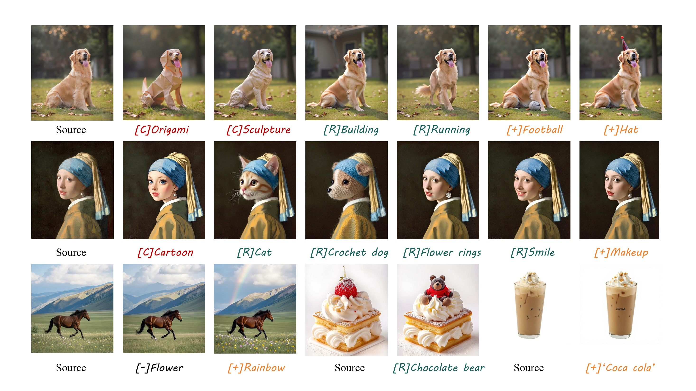
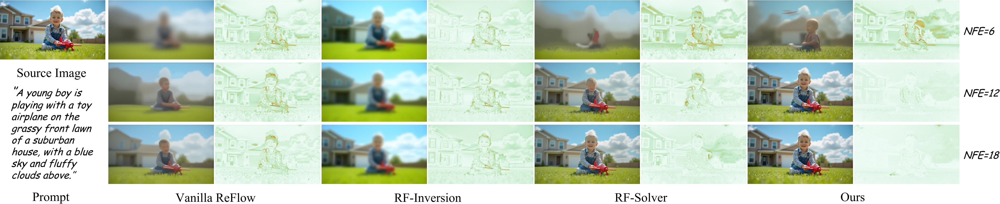

# FireFlow: Fast Inversion of Rectified Flow for Image Semantic Editing

> TL;DR: An 8-step inversion and 8-step editing process works effectively with the FLUX-dev model. (3x speedup with results that are comparable or even superior to baseline methods)

## [1] Preview


Inspired by recent ReFlow based editing approaches, we propose a novel numerical solver for ReFlow models, achieving second-order precision at the computational cost of a first-order method, providing a scalable and efficient solution for tasks such as image reconstruction and semantic editing.

## [2] How to install?
The code environment is consistent with FLUX and the pioneering RF-Solver-Edit. You can refer to the [official FLUX repository](https://github.com/black-forest-labs/flux/tree/main) for details or use the following command to set up the environment.
```shell
conda create --name Fireflow python=3.10
conda activate Fireflow
pip install -e ".[all]"
```
## [3] Demo Scripts: Inversion and Reconstruction 
We have provided a script to reproduce the results presented in the paper. Additional comparison results can be found in <td width="30%" align="center"><a href="src/inversion_reconstruction.sh">inversion_reconstruction.sh</a></td>.
```shell
python edit.py  --source_prompt "A young boy is playing with a toy airplane on the grassy front lawn of a suburban house, with a blue sky and fluffy clouds above." \
                --target_prompt "A young boy is playing with a toy airplane on the grassy front lawn of a suburban house, with a blue sky and fluffy clouds above." \
                --guidance 1 \
                --source_img_dir 'examples/source/boy.jpg' \
                --num_steps 10 \
                --offload \
                --inject 0 \
                --sampling_strategy 'fireflow' \
                --output_prefix 'fireflow' \
                --output_dir 'examples/edit-result/dog' 
```


## [4] Demo Scripts: Semantic Image Editing
We have also provided several scripts to reproduce the results presented in the paper, focusing on three main types of editing: stylization, addition, and replacement.

## [4.1] Stylization
<table class="center">
<tr>
  <td width=10% align="center">Ref Style</td>
  <td width=20% align="center"></td>
	<td width=20% align="center"></td>
  <td width=20% align="center"></td>
  <td width=20% align="center"></td>
</tr>
<tr>
  <td width="10%" align="center">Editing Scripts</td>
  <td width="20%" align="center"><a href="src/run_nobel_trump.sh">Trump</a></td>
  <td width="20%" align="center"><a href="src/run_art_mari.sh"> Marilyn Monroe</a></td>
  <td width="20%" align="center"><a href="src/run_art_mari.sh"> Marilyn Monroe (More Expressive)</a></td>
  <td width="20%" align="center"><a href="src/run_cartoon_ein.sh">Einstein</a></td>
</tr>
<tr>
  <td width=10% align="center">Edtied image</td>
  <td width=20% align="center"></td>
	<td width=20% align="center"></td>
  <td width=20% align="center"></td>
  <td width=20% align="center"></td>
</tr>

<tr>
  <td width="10%" align="center">Editing Scripts</td>
  <td width="20%" align="center"><a href="src/run_nobel_biden.sh">Biden</a></td>
  <td width="20%" align="center"><a href="src/run_art_batman.sh">Batman</a></td>
  <td width="20%" align="center"><a href="src/run_art_batman.sh">Batman (More Expressive)</a></td>
  <td width="20%" align="center"><a href="src/run_cartoon_herry.sh">Herry Potter</a></td>
</tr>
<tr>
  <td width=10% align="center">Edtied image</td>
  <td width=20% align="center"></td>
	<td width=20% align="center"></td>
  <td width=20% align="center"></td>
  <td width=20% align="center"></td>
</tr>
</table>

## [4.2] Adding & Replacing
<table class="center">
<tr>
  <td width=10% align="center">Source image</td>
  <td width=30% align="center"></td>
	<td width=30% align="center"></td>
  <td width=30% align="center"></td>
</tr>
<tr>
  <td width="10%" align="center">Editing Scripts</td>
  <td width="30%" align="center"><a href="src/run_boy.sh">+ hiking stick</a></td>
  <td width="30%" align="center"><a href="src/run_horse.sh">horse -> camel</a></td>
  <td width="30%" align="center"><a href="src/run_boy.sh">+ dog</a></td>
</tr>
<tr>
  <td width=10% align="center">Edtied image</td>
  <td width=30% align="center"></td>
	<td width=30% align="center"></td>
  <td width=30% align="center"></td>
</tr>

</table>

## [4.3] Edit your own image
Use the following script to perform fast editing:
```
cd src
python edit.py  --source_prompt [describe the content of your image or leaves it as null] \
                --target_prompt [describe your editing requirements] \
                --guidance 2 \
                --source_img_dir [the path of your source image] \
                --num_steps 8  \
                --inject 1 \
                --start_layer_index 0 \
                --end_layer_index 37 \
                --name 'flux-dev' \
                --sampling_strategy 'fireflow' \
                --output_prefix 'fireflow' \
                --offload \
                --output_dir [output path] 
```
**Tips:** If the above code **fails to capture the instructions** (such as "can not edit the color"), we provide several settings to help address the issues.
-  Add More Steps / Enlarge Guidance
```shell
python edit.py  --source_prompt [describe the content of your image or leaves it as null] \
                --target_prompt [describe your editing requirements] \
                --guidance 3  \ # 2 -> 3
                --source_img_dir [the path of your source image] \
                --num_steps 15 \ # 8 -> 15
                --inject 1 \
                --start_layer_index 0 \
                --end_layer_index 37 \
                --name 'flux-dev' \
                --sampling_strategy 'fireflow' \
                --output_prefix 'fireflow' \
                --offload \
                --output_dir [output path] 
```
- Using Other Editing Strategies (at the cost of losing the original structure)
```shell
python edit.py  --source_prompt [describe the content of your image or leaves it as null] \
                --target_prompt [describe your editing requirements] \
                --guidance 2 \
                --source_img_dir [the path of your source image] \
                --num_steps 8 \
                --inject 1 \
                --start_layer_index 0 \
                --end_layer_index 37 \
                --name 'flux-dev' \
                --sampling_strategy 'fireflow' \
                --output_prefix 'fireflow' \
                --reuse_v 0 \ # 1 -> 0 to disable default editing strategy
                --editing_strategy 'add_q' \ # 'replace_v' -> 'add_q' / 'add_k' / 'add_v'
                --offload \
                --output_dir [output path] 
```
**Tips:** If the above code **fails to perserve the original image**, we provide several settings to help address the issues.
-  Add More Steps / More injected steps
```shell
python edit.py  --source_prompt [describe the content of your image or leaves it as null] \
                --target_prompt [describe your editing requirements] \
                --guidance 2  \
                --source_img_dir [the path of your source image] \
                --num_steps 15 \ # 8 -> 15
                --inject 2 \ # 1 -> 2
                --start_layer_index 0 \
                --end_layer_index 37 \
                --name 'flux-dev' \
                --sampling_strategy 'fireflow' \
                --output_prefix 'fireflow' \
                --offload \
                --output_dir [output path] 
```
- Using Other Editing Strategies (at the cost of losing the control)
```shell
python edit.py  --source_prompt [describe the content of your image or leaves it as null] \
                --target_prompt [describe your editing requirements] \
                --guidance 2 \
                --source_img_dir [the path of your source image] \
                --num_steps 8 \
                --inject 1 \
                --start_layer_index 0 \
                --end_layer_index 37 \
                --name 'flux-dev' \
                --sampling_strategy 'fireflow' \
                --output_prefix 'fireflow' \
                --reuse_v 0 \ # 1 -> 0 to disable default editing strategy
                --editing_strategy 'add_q replace_v' \ # 'replace_v' -> 'add_q replace_v' / 'add_k replace_v' / 'add_q add_k replace_v'
                --offload \
                --output_dir [output path] 
```

## [5] Acknowledgements
We sincerely thank [RF-Solver](https://github.com/wangjiangshan0725/RF-Solver-Edit) and [FLUX](https://github.com/black-forest-labs/flux/tree/main) for their well-structured codebases. The support and contributions of the open-source community have been invaluable, and without their efforts, completing our work so efficiently would not have been possible. 

Furthermore, I would like to extend my sincere thanks to the owner of RF-Solver's Repo for their prompt and helpful responses to all my questions regarding the code and the ideas presented in their paper. Their support has been invaluable and has greatly assisted me in my work.


